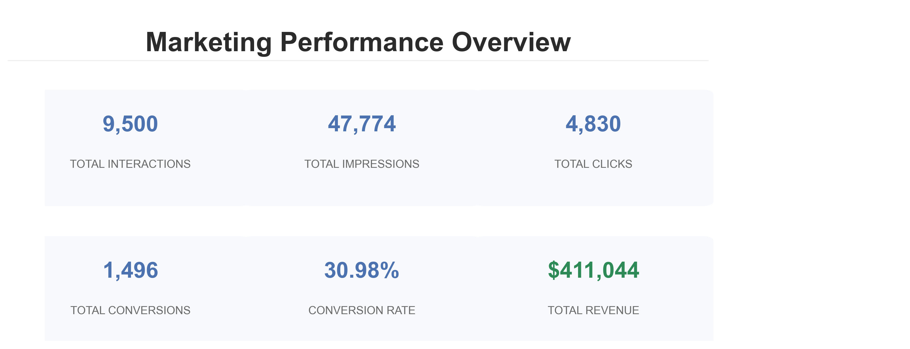
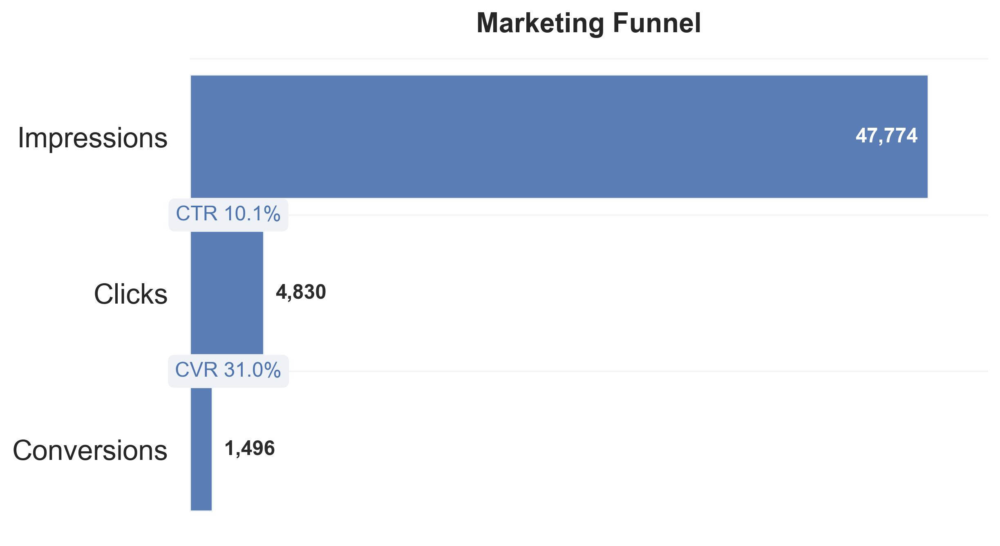
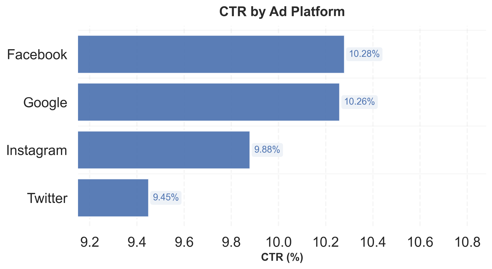
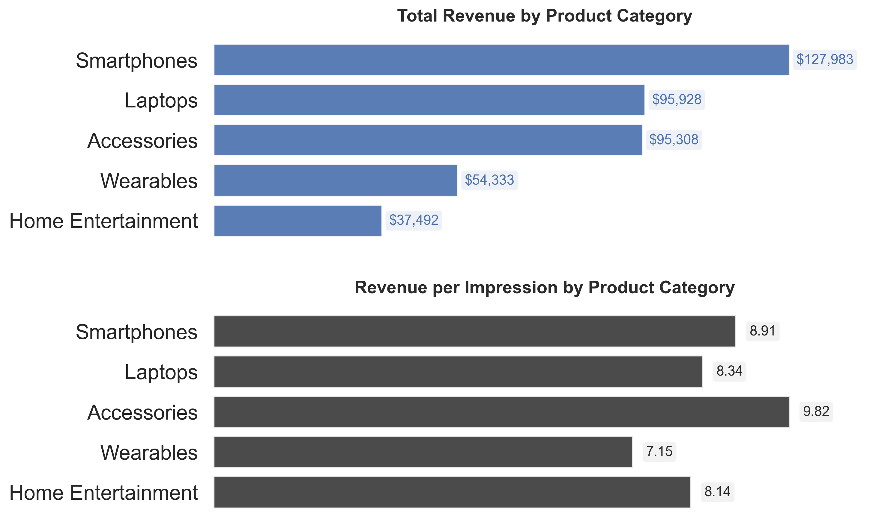
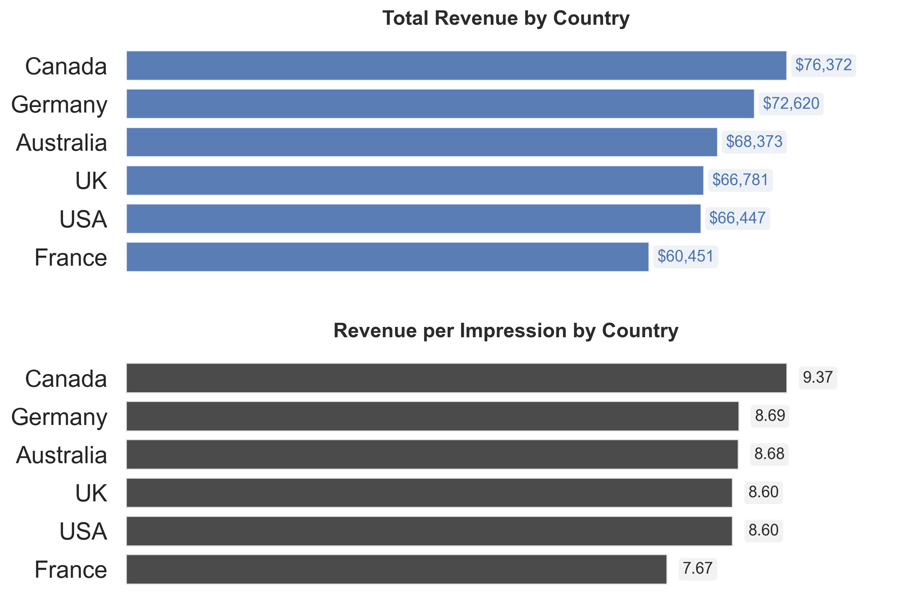
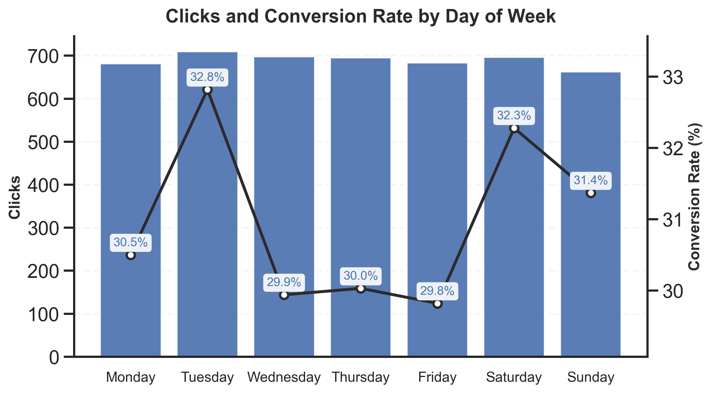

# fitbit_marketing_analysis

## Project Overview

This project analyzes a sample marketing dataset from Fitbit to uncover insights about **ad performance, demographics, engagement, and conversion efficiency**. The goal is to demonstrate SQL-based data modeling, aggregation, and performance analysis techniques, along with business-oriented interpreation of marketing performance metrics.

**Dataset:** `FitBitMarketing.csv` (9,500 rows, 12 columns)
> **Note:** This dataset is publicly available and used for educational and demonstration purposes.

**Key columns:**

| Column            | Description                                      |
|------------------|-------------------------------------------------|
| DateTime          | Timestamp of ad interaction                     |
| CustomerID        | Unique customer identifier                       |
| AgeGroup          | Customer age group                               |
| Gender            | Customer gender                                  |
| Country           | Country of the interaction                       |
| ProductCategory   | Fitbit product category                          |
| CampaignID        | ID of the ad campaign                            |
| AdPlatform        | Ad platform (Google, Facebook, Instagram, etc.) |
| Impressions       | Number of ad impressions                         |
| Clicks            | Number of clicks                                 |
| Conversions       | Number of conversions                            |
| ConversionValue   | Revenue generated from conversions               |

---

## Executive Summary

This analysis evaluates marketing campaign performance across platforms, product categories, geographies, and time to identify key drivers of revenue and efficiency. Overall results show strong post-click performance (~31% conversion rate), indicating effective audience targeting and downstream conversion behavior. Platform performance is relatively stable, with Google and Facebook leading slightly in engagement.  
  
Across product categories and geographies, revenue efficiency is tightly clustered, suggesting that revenue differences are primarily driven by scale (impressions) rather than major performance gaps.
  
Temporal analysis reveals higher conversion efficiency on Tuesdays and Saturdays, indicating potential opportunities for bid or budget optimization without requiring additional traffic volume.

---

## Project Structure
```powershell
fitbit_marketing_analysis/
│
├─ data/
│   └─ FitBitMarketing.csv      			# Raw dataset
├─ sql/
│   ├─ table_setup.sql          			# Creates table & loads CSV
│   └─ queries.sql              			# Analysis queries
├─ results/                     			# Query outputs
├─ notebooks/
│   └─	fitbit_marketing_analysis.ipynb		# Generates figure PNGs
├─ figures/									# Notebook outputs
└─ README.md                    			# This documentation
```
---
## Setup Instructions

**1.** Install PostgreSQL (or ensure you have it installed).

**2.** Clone the repository:
```bash
git clone https://github.com/yourusername/fitbit_marketing_analysis.git
cd fitbit_marketing_analysis
```

**3.** Create a database:
```sql
CREATE DATABASE fitbit;
\c fitbit
```

**4.** Run table setup to create the table and load data:
```bash
psql -d fitbit -f sql/table_setup.sql
```

**5.** Run analysis queries:
```bash
psql -d fitbit -f sql/queries.sql
```
> *Make sure the CSV is located at `data/FitBitMarketing.csv` relative to the repo root.*

---

## Key Analyses

Below are high-level analysis areas, with representative SQL snippets. Full queries are in `queries.sql`.

### 1. Dataset Overview  
  
**Objective:** Establish overall campaign performance and conversion efficiency across all ads.  
  
To quantify overall campaign performance, I aggregated core engagement and revenue metrics across the full dataset.
  
```sql
SELECT
	COUNT(*) AS total_exposures,
	SUM(Clicks) AS total_clicks,
	SUM(Impressions) AS total_impressions,
	ROUND((SUM(Clicks)::DECIMAL / NULLIF(SUM(Impressions),0)*100),2) AS CTR_percent,
	SUM(Conversions) AS total_conversions,
	ROUND((SUM(Conversions)::DECIMAL / NULLIF(SUM(Clicks),0)*100),2) AS conversion_rate,
	SUM(ConversionValue) AS total_revenue,
	ROUND(SUM(ConversionValue)::DECIMAL / NULLIF(SUM(Impressions),0),2) AS revenue_per_impression
FROM
	fitbit_ads;
```
<p align="center">
  
</p>

To better understand user progression from exposure to purchase, I visualized the campaign funnel:
<p align="center">
  
</p>

> **Key Insight:** *With 4,830 clicks generating 1,496 conversions (~31% CVR), the campaigns overall exhibit strong post-click efficiency. The funnel highlights that while impression-to-click drop-off is expected, click-to-conversion performance is particularly strong, suggesting effective targeting.*

### 2. Engagement by Platform

**Objective:** Identify which ad platform drives the highest click-through rate (CTR).  

```sql
SELECT
	AdPlatform,
	SUM(Clicks) AS total_clicks,
	SUM(Impressions) AS total_impressions,
	ROUND((SUM(Clicks)::DECIMAL / NULLIF(SUM(Impressions),0)*100),2) AS CTR_percent
FROM
	fitbit_ads
GROUP BY
	AdPlatform
ORDER BY
	CTR_percent DESC;
```

To compare engagement performance across channels, I calculated total clicks, impressions, and CTR by platform.

<p align="center">
  
</p>

>**Key Insight:**  *Google and Facebook drive the highest engagement (CTR ~10.3%), indicating stronger audience-platform alignment. Instagram and Twitter trail slightly, suggesting potential opportunity for creative or targeting optimization.*

### **3. Revenue / ROI by Product Category**
**Objective:** Compare product categories across both revenue volume and revenue efficiency to identify high-performing and scalable segments.  

```sql
SELECT
	ProductCategory,
	SUM(Conversions) AS total_conversions,
	SUM(ConversionValue) AS total_revenue,
	ROUND(SUM(ConversionValue)::DECIMAL / NULLIF(SUM(Impressions),0),2) AS revenue_per_impression
FROM
	fitbit_ads
GROUP BY
	ProductCategory
ORDER BY
	revenue_per_impression DESC;
```


>**Key Insight:** *Accessories generate the highest revenue per impression, indicating strong monetization efficiency. However, Smartphones lead in total revenue and conversions, indicating higher volume. The relatively small efficiency gap across categories suggests a balanced portfolio rather than dramatic performance divergence.*

### **4. Geography Insights**
**Objective:** Evaluate geographic performance by comparing revenue volume and revenue efficiency (revenue per impression) across countries.  
  
```sql
SELECT 
    Country,
	COUNT(*) AS total_exposures,
	SUM(Clicks) AS total_clicks,
	SUM(Impressions) AS total_impressions,
	ROUND((SUM(Clicks)::DECIMAL / NULLIF(SUM(Impressions),0)*100),2) AS CTR_percent,
	SUM(Conversions) AS total_conversions,
	SUM(ConversionValue) AS total_revenue,
	ROUND(SUM(ConversionValue)::DECIMAL / NULLIF(SUM(Impressions),0),2) AS revenue_per_impression
FROM 
	fitbit_ads
GROUP BY 
	Country
ORDER BY 
	total_revenue DESC;
```

> **Key Insight:** *While Canada leads in both total revenue and revenue per impression, Germany, Australia, the UK, and the USA show comparable revenue efficiency despite generating lower total revenue.
> This suggests that the revenue gap across these markets is primarily driven by scale (impressions) rather than performance quality.  
> France underperforms on CTR and revenue per impression, suggesting potential targeting or messaging inefficiencies relative to other markets.*

### **5. Time-Based Trends**
**Objective:** Identify temporal patterns in user engagement and conversion efficiency to inform campaign scheduling and budget allocation.  
```sql
SELECT 
    CASE 
    	WHEN EXTRACT(DOW FROM DateTime) = 0 THEN '1. Sunday'
    	WHEN EXTRACT(DOW FROM DateTime) = 1 THEN '2. Monday'
    	WHEN EXTRACT(DOW FROM DateTime) = 2 THEN '3. Tuesday'
    	WHEN EXTRACT(DOW FROM DateTime) = 3 THEN '4. Wednesday'
    	WHEN EXTRACT(DOW FROM DateTime) = 4 THEN '5. Thursday'
    	WHEN EXTRACT(DOW FROM DateTime) = 5 THEN '6. Friday'
    	ELSE '7. Saturday' 
    END AS day_of_week,
    SUM(Clicks) AS total_clicks,
    SUM(Conversions) AS total_conversions,
	ROUND(SUM(Conversions)::DECIMAL / NULLIF(SUM(Clicks),0)*100,2) AS conversion_rate_percent
FROM 
	fitbit_ads
GROUP BY 
	day_of_week
ORDER BY 
	day_of_week ASC;
```


> **Key Insight:** *Conversion rates peak on Tuesday (32.82%) and Saturday (32.28%), while click volume is fairly consistent across the week, suggesting that user intent spikes midweek and on weekends even when engagement levels are similar.*

> **Business Implication:** Increasing bid intensity or budget allocation on high-efficiency days may improve overall ROI without increasing traffic volume.  
